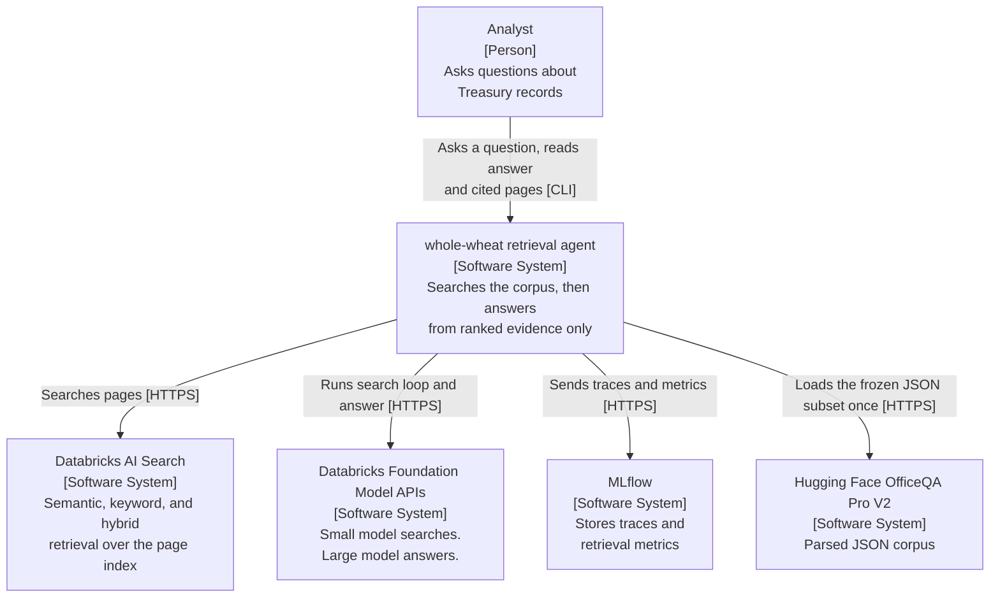
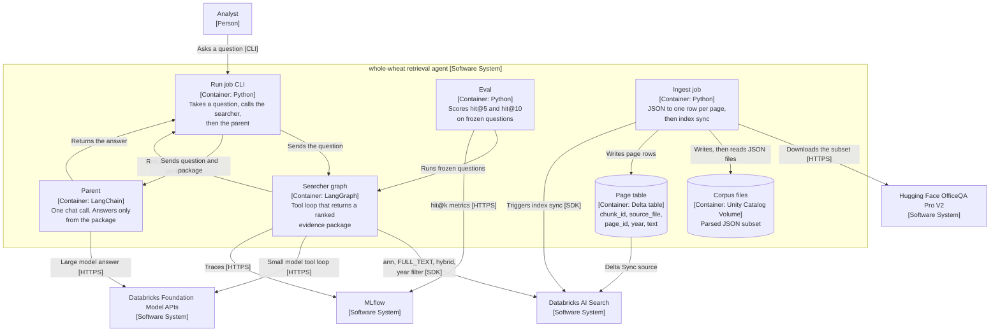
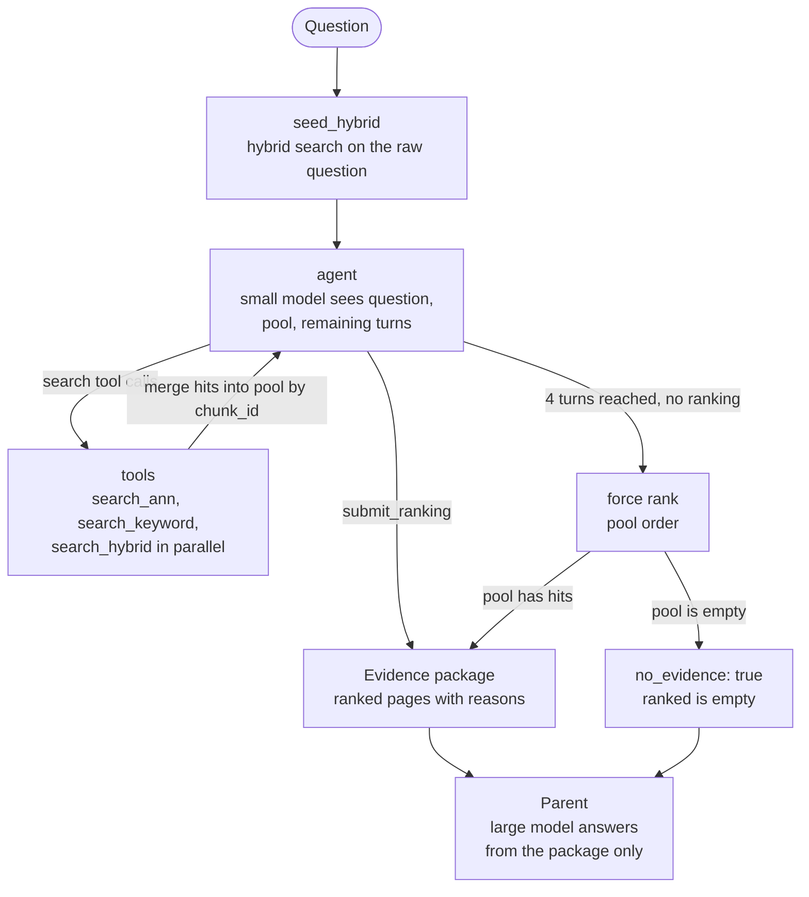

# whole-wheat: Databricks search subagent (blog)

Status: approved
Date: 2026-08-25
Updated: 2026-08-26
Repo: `whole-wheat`

This spec is a teaching clone of the *contract* in Toast 1, SID-1, Chroma Context-1, and Databricks Instructed Retriever. It is not a clone of their weights, indexes, or scores. The code is for a blog post. It is not production.

Inspired by:

- [Toast 1](https://www.mixedbread.com/blog/toast-1)
- [SID-1](https://www.sid.ai/research/sid-1-technical-report)
- [Chroma Context-1](https://www.trychroma.com/research/context-1)
- [Instructed Retriever](https://www.databricks.com/blog/instructed-retriever-unlocking-system-level-reasoning-search-agents)

## Goal

A reader deploys one Databricks Asset Bundle. The bundle indexes a frozen OfficeQA Pro V2 JSON subset. A small Foundation Model runs an iterative search loop. A large Foundation Model writes an answer from ranked evidence only.

Success: the reader can follow one LangGraph trace and see `search_ann`, `search_keyword`, `search_hybrid`, and `submit_ranking`.

## Non-goals

- Training
- PDFs or OCR
- Agent Framework serving
- Databricks App
- AI Search reranker
- Answer exact-match eval
- Quality claims vs Toast-1 or OfficeQA leaderboards

## Contract

Searcher **in:** a natural-language question.
Searcher **out:** a ranked evidence package. No final answer.

Parent **in:** the question plus that package.
Parent **out:** an answer, or a statement that the package is empty.

The parent has no search tools. The job calls the searcher, then the parent.

### Evidence package

```json
{
  "query": "…",
  "ranked": [
    {
      "chunk_id": "source-file::page-3",
      "source_file": "combined_statement__historical__cs-1872",
      "page_id": 3,
      "year": 1872,
      "text": "page text and tables",
      "reason": "one line why this page is in the ranking"
    }
  ],
  "rounds": 2,
  "tool_calls": 4,
  "no_evidence": false
}
```

`ranked` is best-first. `no_evidence` is true only when force-submit has an empty pool.

## Level 1: system context

Scope: the whole-wheat retrieval agent in use. A user asks a question. The agent searches and answers.



## Level 2: containers

Same system, same people, same external systems as Level 1. This level shows the containers inside the agent.



## Searcher workflow

Conceptual LangGraph flow. State: `messages`, `pool`, `ranking`, `rounds`.



## Corpus and ingest

**Source:** [databricks/officeqa-pro-v2](https://huggingface.co/datasets/databricks/officeqa-pro-v2) parsed JSON. No PDFs.

**Subset:** `data/subset.json` is a list of basenames that map to `parsed_corpus/jsons/<name>.json`. Implementation fills the list once. Then the list is frozen. A spec change is required to edit it.

**Page rows:** flatten `text` and `table` elements. One Delta row per page. Columns: `chunk_id`, `source_file`, `page_id`, `year`, `text`. Drop headers, footers, figures.

**Year:** parse from filename or JSON metadata at ingest. If a file has no year, store null. The year filter then skips that row.

**Limits:** AI Search Delta Sync row max is 100 KB. Embedding source column max is 32,764 bytes. Truncate `text` to that cap.

```
# ponytail: truncate page text at 32764 bytes. Split pages later if tables need full fidelity.
```

**Index:** one standard AI Search endpoint. One Delta Sync index, triggered sync. Databricks-managed embeddings on `text`. Endpoint: `databricks-qwen3-embedding-0-6b`. Sync the page columns above. Change Data Feed is on.

**Ingest failure:** fail the job. No half table.

## Search loop

Retriever wrapper over `AISearchClient`. The graph does not import the SDK.

| Tool | AI Search `query_type` |
| --- | --- |
| `search_ann` | `ann` |
| `search_keyword` | `FULL_TEXT` |
| `search_hybrid` | `hybrid` |
| `submit_ranking` | writes the package and ends the loop |

Each search tool: `query`, `k`, optional `year`. Year is an equality filter on column `year`. No `source_file` filter.

Flow:

1. `seed_hybrid` runs the raw question through hybrid search into `pool`.
2. Agent sees the question, seed hits, remaining turns.
3. One model turn can emit several search calls. Run them in parallel. Merge `pool` by `chunk_id`.
4. Agent calls `submit_ranking` with ordered `chunk_id`s and a one-line reason each.
5. Stop on ranking, or after **4** agent turns, then force-rank from pool order.
6. Drop unknown `chunk_id`s. If none remain, use pool order. If the pool is empty, `ranked: []` and `no_evidence: true`.

Searcher system prompt: write one sentence of need. Use `search_ann` for meaning. Use `search_keyword` for names, years, titles, amounts. Use `search_hybrid` when both matter. Pass `year` when the question names a year.

Graph state: `messages`, `pool`, `ranking`, `rounds`.

## Parent

One chat call on the large Foundation Model. Answer only from the package. If `no_evidence` or `ranked` is empty, say so.

## Eval

Frozen qids in `data/qids.json`. Gold `source_files` for each qid must sit in the subset. Implementation picks qids once, then freezes them.

`eval fetch` writes gitignored `data/eval.json` from the gated CSV: `id`, `query`, `source_files`. Do not commit answers.

`eval run` runs the searcher only. A ranked chunk is a hit if `source_file` is in the gold `source_files` list. Report hit@5 and hit@10.

## Observability

`mlflow.langchain.autolog()` around search and eval. One MLflow run per eval question: qid, hit@5, hit@10, rounds, tool-call count. Experiment name lives in the bundle. If MLflow is down, still print the table.

## Errors

- Missing index: tell the user to run ingest, then exit. No auto-ingest.
- Missing `data/eval.json`: tell the user to run `eval fetch`.
- LLM or search failure: retry twice, then fail that query. Ingest failure fails the job.
- Bad tool args: short error string in the tool message. Do not crash the graph.

## Tests

Tests enforce data contracts only. No live workspace. No fake-model behavior tests. No graph loop tests.

| Boundary | Contract |
| --- | --- |
| ingest → Delta / index | page row has `chunk_id`, `source_file`, `page_id`, `year`, `text` |
| retriever → tools | `Hit` has the same fields plus retrieved `text` |
| tools → graph | search tools return a list of `Hit`. `submit_ranking` accepts ordered `chunk_id`s and reasons |
| graph → parent / CLI | evidence package matches the JSON shape above |
| package → eval | hit@k reads `ranked[].source_file` against gold `source_files` |
| package → parent | parent prompt includes the ranked `text` fields |

One typed dict (or equivalent) per row. Tests round-trip JSON and reject missing required keys.

## Defaults

| Knob | Default |
| --- | --- |
| Searcher model | small Databricks Foundation Model (bundle config) |
| Parent model | large Databricks Foundation Model (bundle config) |
| Embedding | `databricks-qwen3-embedding-0-6b` |
| Max agent turns | 4 |
| Seed / tool `k` | 8 |
| Ranking size | up to 10 pages |
| Year filter | optional equality |
| Reranker | off |
| Index sync | triggered |

## Delivery

One Databricks Asset Bundle. Build it in four slices. Each slice has its own implementation plan. Later slices consume earlier *contracts*, not earlier internals.

| Slice | Plan | Live check (manual) |
| --- | --- | --- |
| 1 | Ingest | Page rows in Delta match the contract |
| 2 | AI Search | `ann` / `FULL_TEXT` / `hybrid` return `Hit` |
| 3 | Agent | `search` returns a package. `ask` returns an answer |
| 4 | Eval | hit@k table. MLflow run per question |

Thin notebooks call `src/whole_wheat/`. The notebook is the demo. The package holds the logic.

Workspace names are bundle variables: `catalog`, `schema`, `volume`, `ai_search_endpoint`, `searcher_endpoint`, `parent_endpoint`. Do not hard-code them.

The AI Search *endpoint* is declared in `databricks.yml`. The *index* is created in the Plan 2 notebook.

Corpus load: first a tiny in-repo fixture JSON. Then a Hugging Face download cell that uses `HF_TOKEN`.

You run every live workspace check. CI only runs contract tests.

```text
whole-wheat/
  databricks.yml
  pyproject.toml
  notebooks/
    01_ingest.py
    02_ai_search.py
    03_search_ask.py
    04_eval.py
  data/
    fixture.json         # tiny parsed-JSON-shaped pages for Plan 1
    subset.json          # frozen HF basenames (filled in Plan 1)
    qids.json            # frozen eval ids (filled in Plan 4)
    eval.json            # gitignored
  src/whole_wheat/
    contracts.py
    ingest.py
    retriever.py
    tools.py
    graph.py
    parent.py
    eval.py
  tests/
  docs/superpowers/specs/
  docs/superpowers/plans/
```

## License notes

- Code: Apache-2.0.
- OfficeQA Pro V2: obey the dataset card. Do not commit gated answers.
- Keep attribution for the Treasury corpus and Databricks dataset.

## Out of scope for v1

`read_document`, `source_file` filter, reranker, continuous index sync, parent-as-tool, serving, App UI, full 1,435-file corpus.
